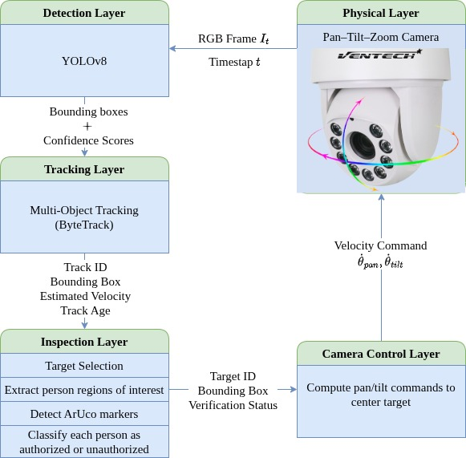

# Warehouse Surveillance – Personal ID Inspection

**Authors:** Inês Peixoto, Ibrahim Ibrahim, Carlos Pazos

---

## Motivation and Benefits

For the final project, we propose a system for Person Detection and Tracking with a PTZ (pan-tilt-zoom) Camera to enhance safety in Human-Robot Interaction (HRI).

With this project, we aim to improve the safety, autonomy, and effectiveness of human-robot interaction systems using a PTZ camera. By enabling rapid identification of intruders and capturing visual evidence of them, this provides a camera-based solution that operates in real time and requires no biometric data. Automated monitoring can improve safety by detecting, tracking, and identifying people without continuous human supervision.

The project is relevant to HRI because the system operates in a human-populated environment, and it must handle uncertainty and multiple people's data association, as well as active perception sensing, decision-making, and action happens in a loop.

---

## System overview

The system uses a pan–tilt–zoom camera mounted in a warehouse. The camera provides RGB video. The system detects and tracks people, checks if they are authorized by detecting an id (ArUco marker) on them, and actively controls the camera to keep the unverified person(s) in the camera’s field of view.

The architecture is divided into five layers:

- Physical layer (camera)
- Detection layer
- Tracking layer
- Inspection layer
- Camera control layer

The system runs in a closed loop.

  

  <b>Figure 1:</b> System architecture of the PTZ-based warehouse surveillance pipeline.

---

## Methods and Algorithms

**Person detection:** We use YOLOv8 [1][2] for real-time person detection from RGB images. YOLO-based detectors are widely used in multi-object tracking pipelines because they provide stable bounding boxes at high frame rates.

**Multi-object tracking:** For tracking, we use ByteTrack [3]. ByteTrack follows a tracking-by-detection paradigm and improves association by using both high-confidence and low-confidence detections. This enables temporal reasoning about human motion, and it is core baseline and an industry standard for real-time tracking high speed and ability to recover "lost" objects while remaining computationally efficient.

**Verification and inspection using ArUco markers:** To distinguish workers from intruders, we use ArUco markers. ArUco detection is fast, does not require training, and avoids biometric identification, especially when privacy is a concern. Alternatively, depending on the ID, it can be detected using a CNN or other computer vision methods.

**Camera control and active tracking:** The camera control layer computes pan, and tilt velocity commands based on the offset between the selected target’s bounding box center and the image center to follow the person. which is sent to the physical camera.

---

## Experimental plan and research principles

Our initial approach is to conduct tests in controlled environments, noting planned scenarios with several people with occlusions, people having an ID (ArUco), people without IDs, and people entering and leaving the field of view. Evaluation will focus on stability of multi-object tracking, correct association of authorization status, intruder detection accuracy using standard computer vision metrics, and camera centering performance over time.

---

## Time plan and milestones

- 30th December: Detection and tracking pipeline.
- 7th January: Target selection logic and ArUco marker detection.
- 15th January: Camera control integration and closed-loop active tracking.
- 21st January: Experiments report and presentation preparation.

---

## References

[1] G. Jocher, A. Chaurasia, and J. Qiu,  
*Ultralytics YOLOv8*, Version 8.0.0, 2023.  
https://github.com/ultralytics/ultralytics

[2] M. Yaseen,  
"What is YOLOv8: An In-Depth Exploration of the Internal Features of the Next-Generation Object Detector,"  
arXiv preprint, 2024.  
https://arxiv.org/abs/2408.15857

[3] Y. Zhang, P. Sun, Y. Jiang, D. Yu, F. Weng, Z. Yuan, P. Luo, W. Liu, and X. Wang,  
"ByteTrack: Multi-Object Tracking by Associating Every Detection Box,"  
European Conference on Computer Vision (ECCV), 2022.
